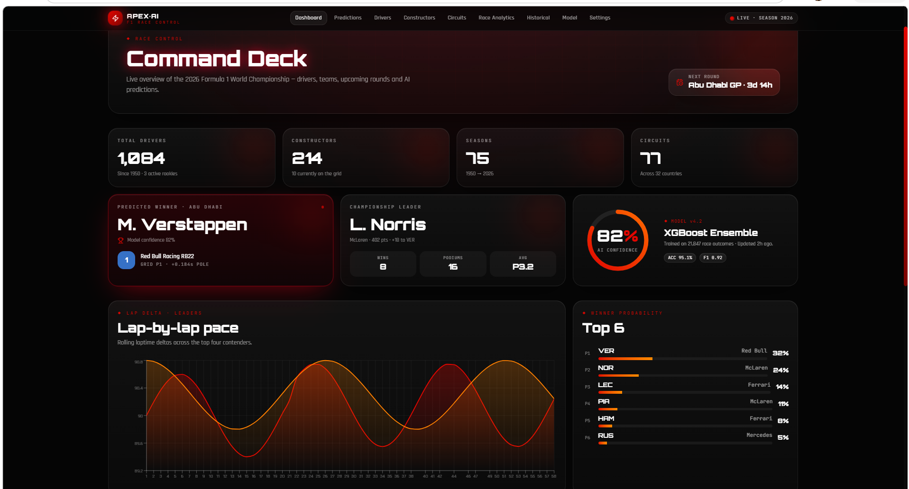
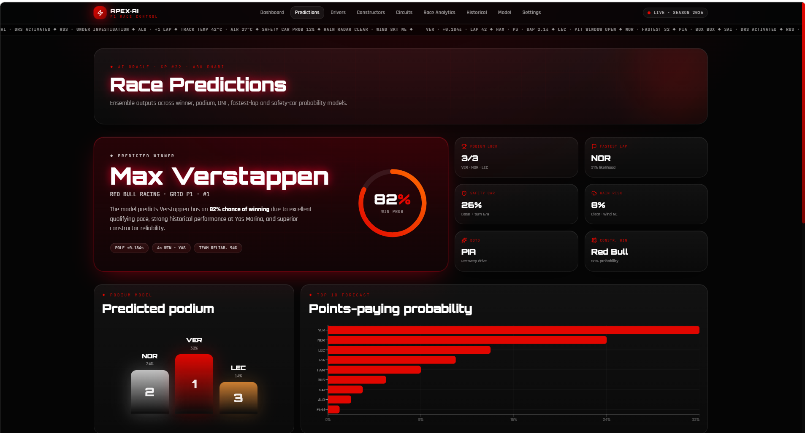
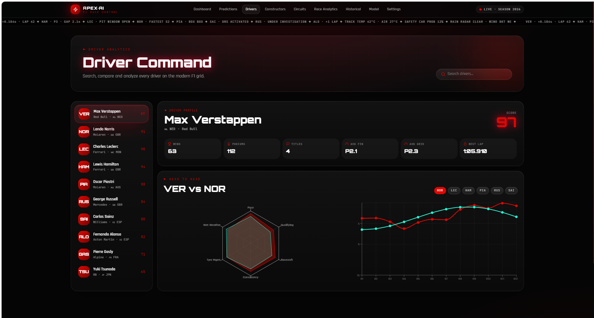
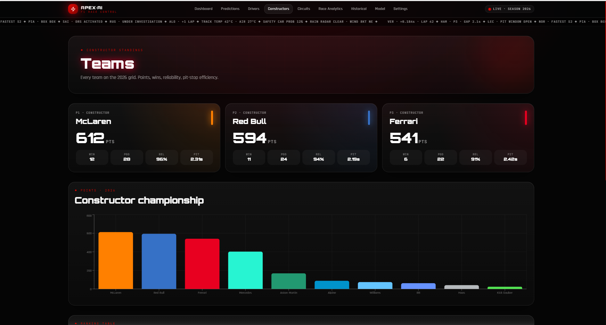
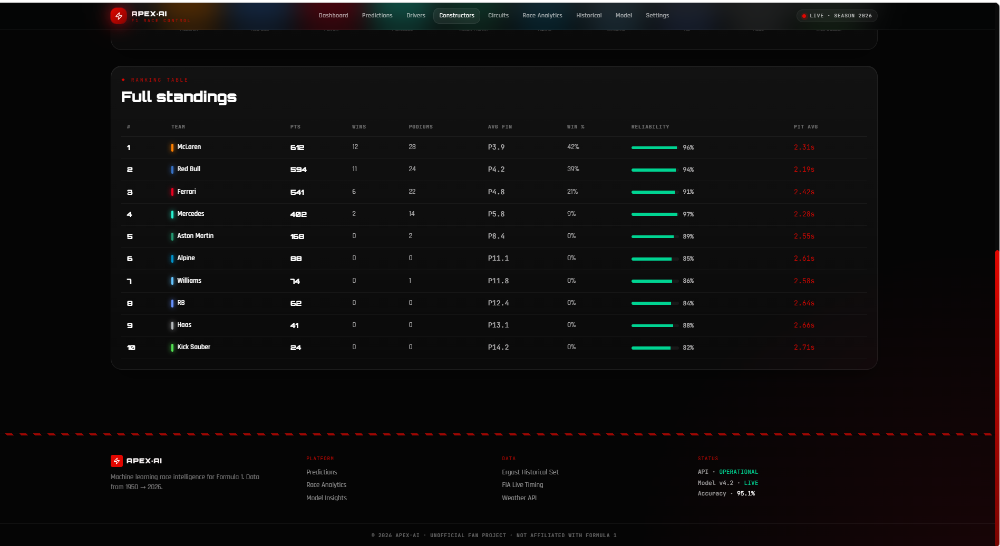
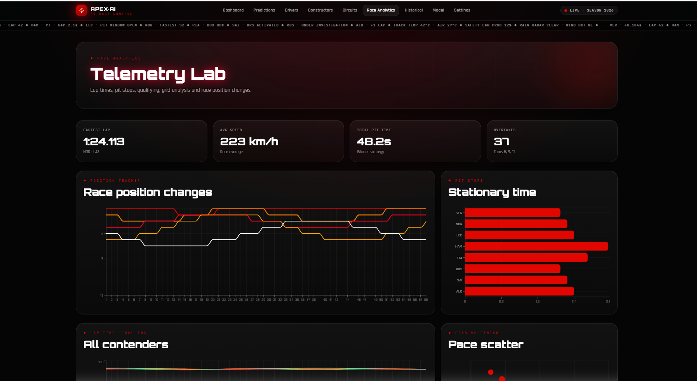
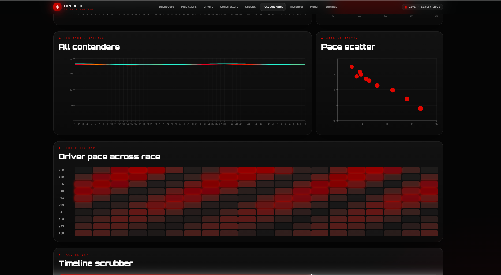
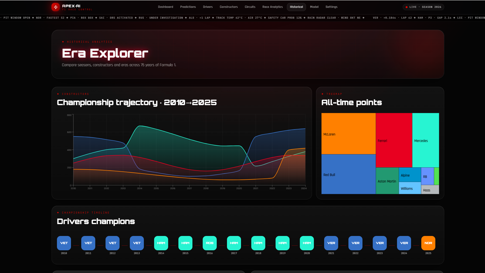
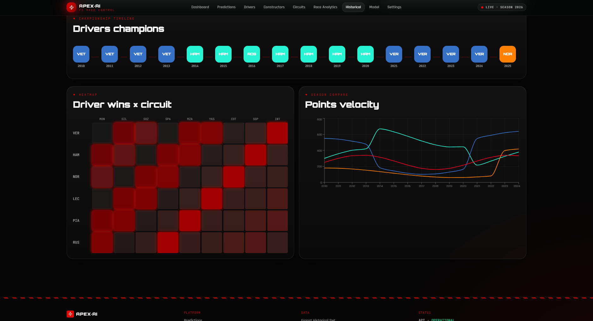

# 🏎️ F1 AI Race Prediction & Analytics Dashboard

An interactive **Formula 1 Analytics Dashboard** built using **React** and **Prompt Engineering**, featuring race predictions, driver analytics, constructor insights, circuit analysis, and historical Formula 1 statistics.

The project showcases a modern, responsive dashboard with premium UI/UX and interactive data visualizations inspired by Formula 1 race analytics platforms.

---

# 📸 Dashboard Preview

> Replace the image filenames with your screenshots.

## Dashboard



## Predictions




## Drivers



## Constructors





## Race Analytics




## Historical Analysis





---

# 🚀 Features

- 🏁 Interactive Formula 1 Dashboard
- 📊 Race Prediction Dashboard
- 👨‍🏎️ Driver Performance Analytics
- 🏆 Constructor Performance Analysis
- 🛣️ Circuit Statistics & Insights
- 📈 Historical Formula 1 Trends
- 📉 Interactive Charts & Visualizations
- 🌙 Modern Dark-Themed UI
- 📱 Fully Responsive Design
- ⚡ Built using Prompt Engineering and React

---

# 🛠️ Tech Stack

- React
- TypeScript
- Vite
- Tailwind CSS
- Recharts
- Framer Motion
- ShadCN UI
- Lucide React

---

# 📂 Data Sources

The dashboard uses publicly available Formula 1 datasets and reference information from:

- Formula 1 Dataset (Kaggle)
- Wikipedia Formula 1 Statistics
- FIA Public Information
- Historical Formula One Records

---

# 💡 Project Highlights

- Modern Formula 1-inspired user interface
- Interactive dashboards and visualizations
- Component-based React architecture
- Responsive design for desktop, tablet, and mobile
- Clean, scalable frontend codebase
- Developed using Prompt Engineering

---

# 📁 Project Structure

```text
src/
├── components/
├── pages/
├── hooks/
├── assets/
├── data/
├── lib/
├── styles/
└── App.tsx
```

---

# 📌 Dashboard Modules

- 🏠 Dashboard
- 🔮 Predictions
- 👨‍🏎️ Drivers
- 🏆 Constructors
- 🛣️ Circuits
- 📊 Race Analytics
- 📈 Historical Analysis
- 🤖 Model Insights

---

# 🚀 Future Enhancements

- Real time Formula 1 data integration
- Machine Learning race prediction models
- FastAPI backend
- Live telemetry dashboard
- Driver comparison engine
- Interactive 3D circuit visualization
- AI Powered race strategy recommendations

